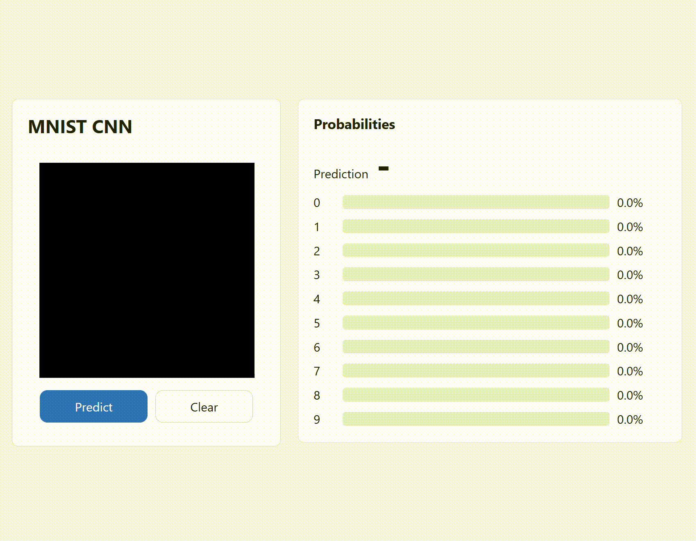

# MNIST CNN in C++

A high-performance convolutional neural network (CNN) implementation written from scratch in C++17, optimized with OpenMP for parallelism. This project enables training, testing, and deploying a handwritten digit recognition (MNIST) model via a CLI interface or an integrated web server.

## 🎥 Demo



## 🚀 Key Features

- **Flexible Architecture**: Network configuration via a JSON file (`architecture.json`).
- **Implemented Layers**: Convolution, BatchNorm, ReLU, MaxPool, Flatten, Dense, Dropout, Softmax, Sigmoid.
- **Optimizers**: Adam and SGD.
- **Performance**: Powered by OpenMP for matrix calculations and tensor operations.
- **Complete Ecosystem**:
  - CLI for training and inference.
  - Web Server (port 8080) with a React interface for real-time drawing and prediction.
  - Built-in data augmentation tool (requires OpenCV).
  - **Flexible Data Formats**: Supports both CSV and Binary (.bin) files for datasets.

## 🏗️ Default Architecture

The model configured in `architecture.json` features a robust structure:
- 4 Convolutional layers with BatchNorm and ReLU.
- Max Pooling (2x2).
- Dropout (0.5) to prevent overfitting.
- Dense output layer with Softmax for classification.

## 🛠️ Installation

### Prerequisites
- C++17 compiler (GCC recommended).
- OpenMP (for parallelism).
- OpenCV (optional, only required for `mnist_augment`).
- `pkg-config` (for dependency detection).

### Compilation
```bash
# Build in release mode (optimized)
make

# Build in debug mode
make debug

# Format code
make fmt
```

## 📖 Usage (CLI)

The main binary is `mnist_cnn`. It automatically detects the dataset format based on the file extension (`.csv` or `.bin`).

- **Training**:
  ```bash
  ./mnist_cnn train <data.csv|.bin> architecture.json model.bin [epochs=10 lr=0.001]
  ```
- **Test / Evaluation**:
  ```bash
  ./mnist_cnn test <data.csv|.bin> model.bin
  ```
- **Inference**:
  ```bash
  ./mnist_cnn predict model.bin <data.csv|.bin> [index=0]
  ```
- **Model Info**:
  ```bash
  ./mnist_cnn info model.bin
  ```

## 🌐 Web Server

Launch the server to use the graphical interface:
```bash
./mnist_server [model.bin]
```
Then access `http://localhost:8080` to test the model by drawing directly on a React canvas.

## 📈 Data Augmentation

To improve model accuracy, you can generate additional data (supports CSV to BIN conversion):
```bash
./mnist_augment <input.csv> <output.bin> [copies=9]
```

## 📂 Project Structure

- `src/core/`: Core logic (CNN, Server, Main).
- `src/layers/`: Implementation of various neural network layers.
- `src/mnist/`: Dataset management and data augmentation.
- `src/utils/`: `Tensor` class and mathematical utilities.
- `public/`: Frontend interface (React/HTML).
